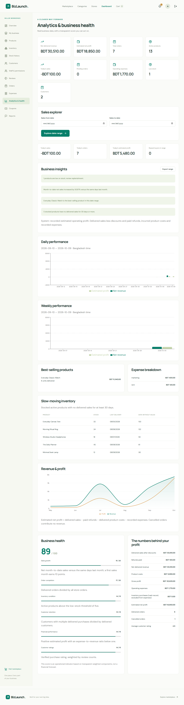

# BizLaunch

BizLaunch combines a multi-vendor marketplace with small-business operations: store creation, catalog and inventory, orders, customers, expenses, estimated profit and business insights. Built with JavaScript, React/Vite, Express and MongoDB/Mongoose.


## Start the project

Use Node.js 22.12+ and MongoDB Community Server or Atlas. MongoDB must be running before starting the API.

```powershell
npm ci
npm --prefix server ci
npm --prefix client ci
```

Copy `server/.env.example` to `server/.env`. Configure `MONGO_URI`, a unique `JWT_SECRET` of at least 32 characters, `CLIENT_URL`, and Gmail SMTP as described in [Email setup](docs/EMAIL_SETUP.md). Never commit `.env`.

Open two terminals in the project root:

```powershell
# Terminal 1
npm run dev:server
```

```powershell
# Terminal 2
npm run dev:client
```

Open **http://localhost:5173**. API: **http://localhost:5000/api/health**. Vite proxies `/api`, `/uploads`, `/demo` and `/socket.io`. `BIZLAUNCH_API_URL` overrides the API proxy target.

If a port is already in use, use the existing running process or stop its terminal with Ctrl+C before starting another. If Vite selects another port, include its exact origin in `CLIENT_ORIGINS` and set `CLIENT_URL` to the URL used for email links.

## Accounts and email

Registration creates customer or seller accounts. Every role must confirm its email before signing in. Public registration cannot create an administrator. Verification lasts 24 hours; reset links last 30 minutes. SMTP proves mailbox ownership through delivery and confirmation; simply entering an address never verifies an account.

The requested administrator, seller and customer accounts are provisioned locally; their personal password is hashed and excluded from this repository. Confirm each mailbox using the verification page. Use Gmail's **App Password**, rather than the regular Gmail password, for SMTP.

For a fresh demonstration database, `npm run seed` adds a sample store, categories, products, variants, coupons, expenses and historical orders. It preserves existing records and passwords and is disabled in production. Demo addresses do not bypass verification in the normal application.

Automated tests alone use these verified fixtures in isolated databases:

| Role     | Email                   | Fixture password |
| -------- | ----------------------- | ---------------- |
| Admin    | admin@bizlaunch.demo    | BizLaunch123!    |
| Seller   | seller@bizlaunch.demo   | BizLaunch123!    |
| Customer | customer@bizlaunch.demo | BizLaunch123!    |

## Complete workflows

- **Business launch:** four-step wizard, unique URL, logo/cover upload, category/type, contact/social links, three themes, delivery information and return policy. Public visibility requires active owner and platform approval.
- **Catalog:** products, category/subcategory, SKU, brand, size/color/weight, list/selling prices, cost, draft/active/archive states, independent variant price/cost/stock and up to eight images. Zero stock derives an out-of-stock state.
- **Inventory:** atomic stock changes, version protection and an auditable PURCHASE/SALE/RETURN/ADJUSTMENT ledger. Staff can replenish or adjust stock within their assigned business; low/out-of-stock order alerts reach the owner.
- **Marketplace:** animated CSS 3D homepage with reduced-motion support, category and store directories, trending/new/offers collections, name/brand/SKU/description search, category/store/price/rating/availability/discount filters, sorting and pagination. Stores expose Products, Reviews and About tabs.
- **Customer workspace:** profile/photo/password change, persistent private wishlist, grouped multi-store cart synchronized with MongoDB, quote confirmation, shipping fields, COD checkout, purchase history, delivery tracking, reviews and notifications.
- **Order operations:** searchable, date-filtered, paginated customer/seller/admin list; per-store fulfillment; tracking reference; cancellation before shipping; recorded COD collection; customer return requests, seller decisions and physical inspection; admin-reviewed partial/full manual refunds with payout receipt and history.
- **Seller operations:** customer CRM, repeat buyers, editable expenses, percentage/fixed scheduled coupons, review replies, downloadable reports and permission-based staff invitation/acceptance/revocation.
- **Analytics:** today/daily/weekly/monthly revenue and estimated profit, date explorer, refund deductions, cost of goods sold, operating expenses, expense breakdown, best sellers, slow-moving stock, sales growth, customer retention, transparent six-factor health score and actual-data insights.
- **Administration:** user/seller suspension, business approval/rejection/suspension, category management, product visibility moderation, review moderation, product/store/review reports, platform analytics, payment/refund monitoring, support/settings, registration control and audited maintenance scheduling.
- **Notifications:** authenticated Socket.IO personal rooms plus a persistent paginated inbox, unread counter and individual/all-read actions. Email verification, reset and staff invitations use Gmail SMTP.

[Feature coverage](docs/FEATURE_COVERAGE.md) maps all 58 planning sections to the application. [API reference](docs/API.md) documents routes and contracts. [FYP report](docs/PROJECT_REPORT.md) explains the architecture, algorithms, data choices, test evidence and deployment scope.



## Technology and architecture

Frontend: React, Vite, React Router, Axios, Tailwind utilities with custom CSS, React Hook Form for staff invitations, Recharts, Lucide, React Hot Toast and Socket.IO client. Backend: Node.js, Express, Mongoose, JWT in HttpOnly cookies, bcrypt, Multer, optional Cloudinary and Socket.IO.

```text
client/src/components  shared forms, layout and interactions
client/src/context     authentication, cart, platform config and realtime
client/src/pages       public, customer, seller, staff and admin pages
server/routes          validated, role-scoped HTTP endpoints
server/controllers     authentication, checkout, refunds and returns
server/services        pricing, inventory, finance, insights, email and media
server/models          documents, indexes and schemas
server/tests           isolated integration tests
```

Order items, per-store fulfillments, refund/return cases and inventory movements are embedded snapshots. Staff membership, carts and wishlists are separate collections. Derived analytics are calculated from source records instead of storing stale duplicate totals. One multi-store purchase has one order with independent store fulfillments, totals and timelines.

## Verify

```powershell
npm run lint
npm run build
npm test
npm --prefix client exec playwright install chromium
npm run test:e2e
```

Current verification: **41 API/mail tests**, **39 API tests on a replica set**, and **15 browser workflows**. Tests cover authorization, ownership, verification/reset, session invalidation, concurrency, stock compensation, multi-store/variant checkout, coupon allocation, payment/refund/return state changes, accounting, staff restrictions, wishlist/moderation and Socket.IO room isolation.

API tests create and remove a uniquely named `bizlaunch_test_*` database. Browser tests use `bizlaunch_e2e_*` and dedicated ports **5001/5174**. They preserve normal accounts and data. Screenshots go to ignored `artifacts/`; selected demonstration images are in `docs/screenshots/`.

For local transactional testing:

```powershell
$env:MONGOD_BINARY='C:\Program Files\MongoDB\Server\9.0\bin\mongod.exe'
npm run test:transactions
```

The helper creates an isolated replica set on port 27018, runs tests and removes only its own temporary data. Use `TEST_MONGO_PORT` for another port. CI checks build/lint, API/browser flows and replica-set behavior.

## Deployment and integrations

Use HTTPS, production secrets and `NODE_ENV=production`. Serve the built SPA and API from the same site; reverse-proxy `/api`, `/uploads`, `/demo` and `/socket.io`, enable WebSocket upgrade, and provide SPA route fallback. `npm start` starts the API; it does not host the frontend build.

**Production requires MongoDB Atlas or a replica set** for checkout, cancellation, return receipt and staff acceptance transactions. Standalone MongoDB is supported locally with atomic stock updates and request-failure compensation; that fallback cannot guarantee process-crash recovery between writes.

Uploads use local Multer storage by default. Configure all three `CLOUDINARY_*` values in `server/.env` to enable hosted images. Persist and back up local uploads when deploying. Removing a product image detaches it; historical assets remain available.

Payment is COD and standard delivery is free. Marking delivery requires explicit collection confirmation. Older delivered records with no payment entry require a separate collection receipt before refund eligibility. Refund completion records a real external payout reference and confirmation; it does not initiate bank/mobile transfers. Return receipt requires physical confirmation and inspection; it restocks only resalable items, once.

Estimated net profit = delivered sales after discounts − completed refunds − delivered product costs + inspected resalable return cost reversals − recorded operating expenses. Product-purchase cash entries are reported separately to avoid double counting costs already recognized in COGS. Tax, supplier payables, marketplace fees, formal accounting statements, courier APIs, online payment gateways and SMS are outside the specified COD project model.

Cloudinary live upload needs credentials; local uploads are tested. A public production deployment requires a hosting account/domain and production environment. Platform verification is an internal review workflow, not government certification.

## Repository

Project repository: [rajmukut791/BizLaunch](https://github.com/rajmukut791/BizLaunch). Secrets, dependencies, local uploads and test databases are excluded from Git.
