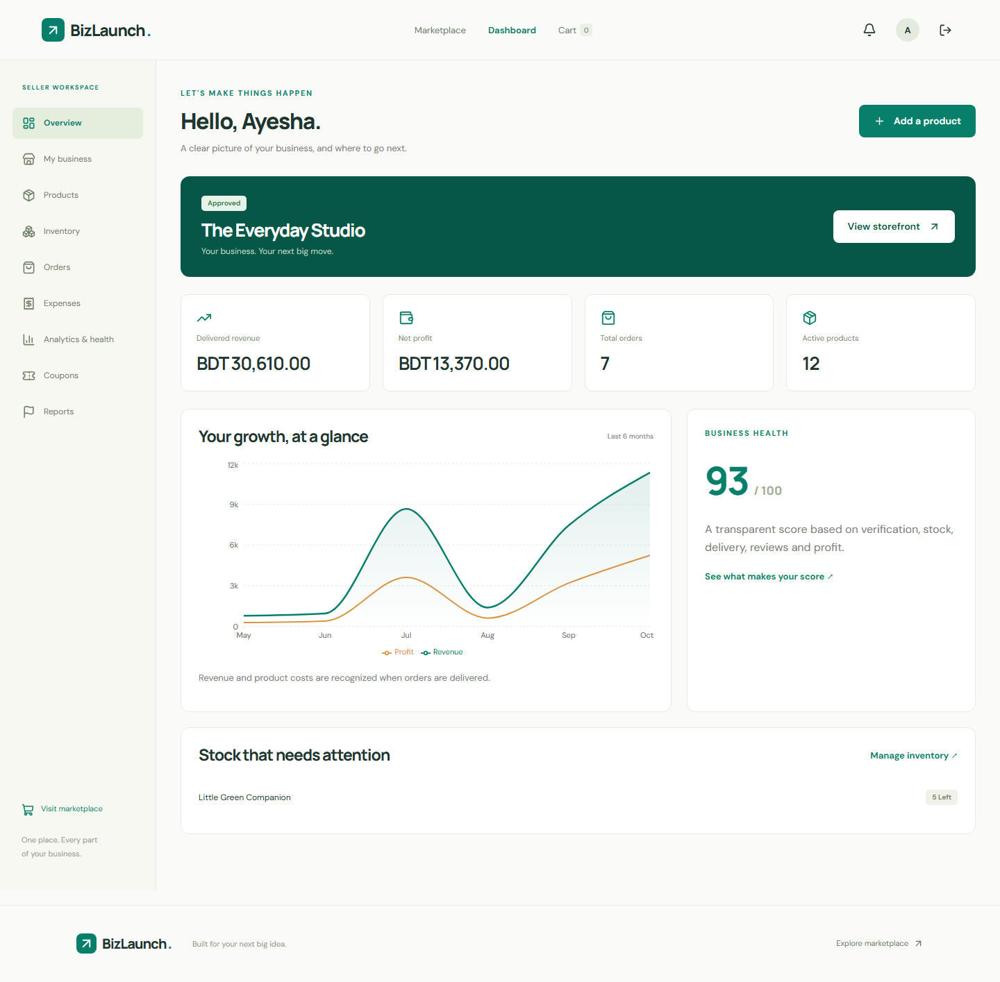

Email verification is now required for every role. See [Gmail setup](docs/EMAIL_SETUP.md). Normal demo addresses cannot sign in; isolated tests use verified fixtures.

# BizLaunch

A business management platform and public marketplace for independent sellers, built with **React, Vite, Express, MongoDB and JWT authentication**.

Customers discover verified stores, choose product variants, confirm discounts, order with cash on delivery and follow delivery progress. Sellers manage their storefront, products, images, inventory, orders, expenses, coupons and profitability. Administrators manage categories, business verification, users and customer reports.


## Run locally

Requirements: Node.js **22.12 or newer**, npm, and MongoDB (local or Atlas).

```bash
npm ci
npm --prefix server ci
npm --prefix client ci
```

Copy `server/.env.example` to `server/.env`, set your MongoDB connection, and replace the placeholder JWT secret with a unique random secret of at least 32 characters.

```bash
# Optional: demo accounts, products and analytics
npm run seed

# Terminal 1
npm run dev:server

# Terminal 2
npm run dev:client
```

Frontend: http://localhost:5173

API: http://localhost:5000

Vite proxies `/api`, `/uploads` and `/demo` to the API. Set `BIZLAUNCH_API_URL` when using a different API address. Set `CLIENT_URL` to the exact frontend origin.

## Isolated test accounts

| Role     | Email                   | Default password |
| -------- | ----------------------- | ---------------- |
| Admin    | admin@bizlaunch.demo    | BizLaunch123!    |
| Seller   | seller@bizlaunch.demo   | BizLaunch123!    |
| Customer | customer@bizlaunch.demo | BizLaunch123!    |

These addresses are login fixtures only in isolated automated test databases. Normal demo seeding creates unverified users that cannot sign in. Configure Gmail SMTP and register real addresses for interactive use.

The seeder is disabled in production. Set `DEMO_PASSWORD` before the first seed to use your own password. Re-running the seeder adds missing demo records without clearing your database or resetting existing account passwords. Existing demo products and orders are preserved.

The demo store is **The Everyday Studio** at `/stores/everyday-studio`. Coupon **LAUNCH10** discounts eligible store items by 10%, with a minimum purchase of BDT 300. Its initial expiry is 180 days after first seeding.

## Feature walkthrough

1. **Register** as customer or seller, then verify the link sent to your mailbox before signing in. Public registration cannot create admins.
2. **Seller onboarding:** create one business per seller and choose a unique store URL.
3. **Admin verification:** review and approve the business before its products appear publicly.
4. **Catalog:** admins maintain shared categories; sellers create, edit, archive and restore products.
5. **Images:** upload up to eight PNG, JPEG or WebP images per product, each up to 5 MB.
6. **Variants & stock:** each variant has its own SKU, price, unit cost and quantity. Set stock to zero to retire a saved variant; saved IDs are preserved for order history. Editing archived products can restore them.
7. **Shopping:** search, filter by category and price, sort results, paginate, visit stores and choose variants.
8. **Cart & checkout:** cart persists in the browser. Review current server prices, coupon discounts and the confirmed total before submitting a cash-on-delivery order.
9. **Orders:** each store has its own fulfillment timeline, even for multi-store orders. Sellers progress from placed → confirmed → processing → shipped → delivered. Add a tracking reference when shipping.
10. **Cancellation:** customers can cancel unconfirmed store items. Sellers/admins can cancel before shipping; cancelled inventory returns to stock once.
11. **Reviews:** customers can leave or update one review per product after delivery.
12. **Finance:** record operating expenses and product unit costs. Revenue and product costs are recognized on delivery; net profit subtracts both product cost and operating expenses.
13. **Analytics:** monthly revenue/profit chart, low-stock list, customer ratings and a transparent business health score.
14. **Coupons:** store-specific percentage discounts, expiry, minimum purchase, activation and atomic usage limits. Usage counts successful orders, including orders later cancelled.
15. **Notifications & reports:** in-app order/business/report updates, mark-all-read, customer concerns, admin resolution, and downloadable financial reports.



## Verification

```bash
npm run lint
npm run build
npm test
npm run test:e2e
```

Install Chromium once for browser tests:

```bash
cd client
npx playwright install chromium
cd ..
```

API tests create a unique `bizlaunch_test_*` database and remove only that database afterward. Browser tests use a unique `bizlaunch_e2e_*` database and dedicated ports **5001 / 5174**, so they do not edit the normal demo database. Screenshots are written to `artifacts/`.

The API suite covers email verification, expired/single-use links, password reset, session invalidation, validation, cookie sessions, ownership, role restrictions, verified store visibility, coupon calculation, stale quotes, duplicate checkout, concurrent stock reservations, multi-store and multi-variant orders, cancellation, review permissions, notifications, suspension and financial calculations. Browser tests exercise real customer, seller and administrator flows and mobile overflow.

To verify transactions locally, install MongoDB Server, make `mongod` available on PATH (or set `MONGOD_BINARY`), and run:

```bash
npm run test:transactions
```

This launches an isolated temporary replica set on port **27018**, runs the API suite and removes its own temporary data directory. `TEST_MONGO_PORT` can select a different free port. GitHub Actions checks build/lint, standalone API/browser tests and replica-set API tests.

## Architecture

```text
client/src/
  components/       Forms, states, layout and reusable UI
  context/          Session and persistent cart state
  lib/              API client and resource hooks
  pages/            Marketplace, auth, customer, seller and admin routes
server/
  config/           Environment and database initialization
  controllers/      Authentication, quotes and order workflows
  middleware/       Authentication and role enforcement
  models/           User and commerce schemas
  routes/           Role-scoped API endpoints
  services/         Pricing, analytics and notifications
  scripts/          Demo seeding and isolated test servers
  tests/            Integration tests
```

See [API documentation](docs/API.md) and [the 39-step roadmap](ROADMAP.md).

## Production configuration and scope

- Use HTTPS and `NODE_ENV=production`. Session cookies become Secure, HttpOnly and SameSite=Strict.
- Serve the built frontend and API from the same site, reverse-proxying `/api`, `/uploads` and `/demo`. Configure SPA fallback to `index.html` for frontend routes. `npm start` starts the API; it does not serve the frontend build.
- **A MongoDB replica set or Atlas is required for production checkout/cancellation.** These operations use database transactions. Standalone MongoDB is supported for local development with atomic stock writes and request-failure compensation. Its fallback does not guarantee recovery from process termination or database failure between writes; production rejects this fallback.
- Persist and back up `server/uploads` when deploying. Uploaded assets are public product images. Removing an image detaches it from the product; old files are retained to preserve historical order images.
- The implemented payment method is **cash on delivery**, with free delivery. Tracking is a seller-managed timeline/reference. Notifications are an in-app inbox. Online payment gateways, live courier APIs, refunds/returns, order emails, SMS and push delivery require separate integrations. Verification and password-reset email are implemented with Gmail SMTP.
- Reports use the currently recorded unit cost at order placement; tax, marketplace fees and supplier accounting are outside this project's financial model.
- Admin/seller management lists are capped at 200 recent records; notification/review lists are capped at 100/50. Public product listings are paginated.
- Keep secrets out of Git. The local `.env`, upload data, database artifacts and dependencies are ignored. Create production admins through a controlled provisioning process, not demo seeding.

## GitHub

The local repository and CI workflow are prepared. Publishing requires the destination GitHub repository and authenticated Git access. After choosing a repository, add its URL as `origin` and push the local branch. GitHub upload is tracked separately in the roadmap; it is not represented as completed before an actual push.

## Admin platform care

Premium admin overview and Maintenance studio support custom visitor messages, preview, scheduled reopening and a 20-entry activity history. Maintenance defaults to Online. See [maintenance operations](docs/ADMIN_MAINTENANCE.md).
