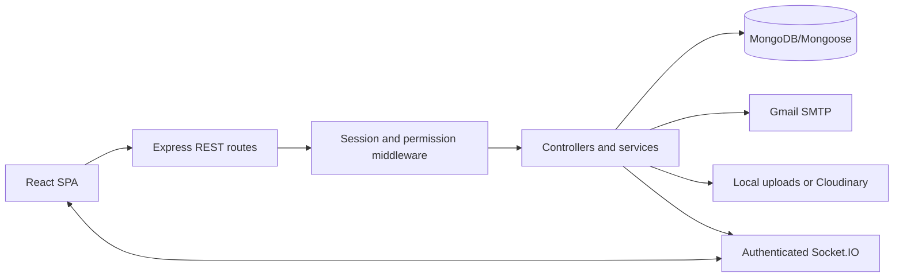

# BizLaunch — Final Year Project Report

## Abstract

BizLaunch is a MERN application that combines multi-vendor commerce with small-business operational management. A verified seller establishes a branded storefront, maintains a catalog and inventory, receives customer orders, records expenses and COD payments, and monitors system-recorded estimated profitability. Customers discover approved stores, purchase products from several sellers in one checkout, track independent fulfillments, submit verified purchase reviews, request returns and follow refund decisions. Platform administrators moderate businesses, products, users, reviews and reports, and manage availability and platform settings.

The implementation uses server-authoritative pricing, inventory version checks, transaction-supported state changes, immutable order snapshots and role-scoped access. It includes staff collaboration, a traceable stock ledger, private wishlists, real-time notifications and transparent operational health scoring. It provides a usable academic demonstration without claiming to implement formal accounting, government certification or bank transfers.

## 1. Problem and objectives

A small seller often operates separate social pages, spreadsheets, messaging apps and paper records. This creates duplicate entry, uncertain stock, fragmented order tracking and incomplete understanding of expenses and profit. A marketplace alone provides product discovery but does not solve the operational side of launching and running a business.

The objectives are to:

1. Help a seller launch an identifiable, branded store through a guided setup.
2. Provide shared catalog, inventory, orders, customers and expense operations.
3. Support verified customer commerce across multiple sellers.
4. Enforce ownership and job permissions on the server.
5. Derive explainable analytics and estimated business profit from recorded activity.
6. Provide platform oversight, moderation and internal verification.
7. Demonstrate correctness through integration, transactional and browser tests.

## 2. Actors and permissions

| Actor           | Responsibilities                                                                                                                                          |
| --------------- | --------------------------------------------------------------------------------------------------------------------------------------------------------- |
| Admin           | Platform statistics, verification/suspension, users/categories, moderation/reports, order supervision, refund review/payout records, maintenance/settings |
| Seller/owner    | One owned business, branding/catalog/variants/inventory, order processing, CRM, expenses/coupons, reviews/analytics and staff                             |
| Customer        | Discovery, profile, private wishlist/cart, checkout/history/tracking, delivered-purchase reviews, return/refund requests and reports                      |
| Manager staff   | Products, inventory, orders, customers, finance, reviews and settings within the assigned business                                                        |
| Sales staff     | Orders, customers and reviews within the assigned business                                                                                                |
| Inventory staff | Inventory and stock history; product data without financial cost fields                                                                                   |

Staff invitations require access to the invited verified mailbox. Acceptance invalidates the earlier session and requires a fresh staff login. Revocation changes membership and invalidates sessions. Staff cannot manage invitations or platform administration. Hiding a link is only a presentation choice; every API enforces authorization independently.

## 3. Functional requirements and processes

### Authentication

Registration validates identity, phone, email and password confirmation. Public account types are seller and customer. Passwords are bcrypt hashes. Verification/reset links use cryptographically random tokens; only hashes are stored. Verification has a 24-hour expiry and reset has a 30-minute expiry. Token consumption is single-use. Gmail SMTP delivers branded HTML and plain-text alternatives. Login checks verification, account status and password, then issues an HttpOnly JWT cookie. Logout, password reset and password change invalidate previous sessions through a token version.

### Store launch and verification

The four-step wizard collects identity, branding/theme, contact/social details and store configuration. Logos and cover images are optional during launch and can be added later. A business begins pending internal review. Admin approval exposes an active business publicly. Rejection includes a note and supports re-submission; suspension hides the storefront and prevents new checkout. Material changes to name, phone or address require review again. This is platform-level verification, not certification by a government authority.

### Catalog and inventory

Products include category/subcategory, description, brand, SKU, prices/cost and physical attributes. Draft and archived products remain manageable privately; active products can be listed. Variants preserve their IDs and historical references and have independent stock, SKU, price and cost. Out-of-stock is derived from quantity rather than a manually conflicting status.

Each stock mutation carries a before value, after value, signed quantity, operation, reference, actor and timestamp. Initial purchases, sales, cancellation returns, manual adjustments and inspected resalable returns form the ledger. A stale edit receives a conflict rather than overwriting another worker. Stock may not become negative. Public product and inventory-only staff responses remove unit costs and internal stock history.

### Discovery and purchase

The homepage provides an animated brand introduction and reuses the marketplace listing for collections. Public Categories and Stores pages provide direct navigation. Filters combine category/store, price, rating, availability and discount with search, sorting and pagination. Storefronts show products, public reviews, business contact and policies.

A customer cart groups items by seller. The authenticated cart is private and persisted in MongoDB; guest selections can merge into the signed-in cart. Checkout first requests a server quote. The server loads current public products and variants, calculates store-scoped coupon eligibility and allocates discounts, then returns the payable total. Prices supplied by clients are ignored. The UI confirms a quote; a changed expected total receives a conflict before stock reservation.

One checkout creates one order document with one fulfillment per store. Each store has independent management, progress, discounts, totals and payment records. Seller responses expose only their own lines and fulfillment. An idempotency key allows safe retry after a network failure without another stock reservation.

### Fulfillment, payments, returns and refunds

Normal fulfillment is placed → confirmed → processing → shipped → delivered. Shipping can record a tracking reference. Customers cancel only placed fulfillments; sellers/admins can cancel before shipping. Cancellation restores reserved quantities once.

Delivery requires explicit COD collection confirmation and records the store's discounted payable amount. Legacy delivered records without a payment record require explicit collection confirmation and a reference before refund eligibility. No fabricated payment gateway response is used.

A return covers all purchased items from one store. It is requested after delivery, approved or rejected, and received only after physical confirmation. The seller records whether every item is suitable for resale. Resalable returns restore quantities once and reverse recognized product cost; unusable goods do not return to sellable stock. Refund processing is independent so receiving goods does not claim a cash payout occurred.

A paid delivered/returned fulfillment can have one partial/full refund case. The amount is capped at the remaining refundable amount. Admin approval/rejection and completion require notes and version checks. Completion requires a real external payout confirmation and receipt/reference. The system records and accounts for that payment; it does not transfer money. Terminal cases cannot be replayed to duplicate a payout entry.

### Reviews, coupons and notifications

Only customers with a delivered purchase can review a product. A customer has one updatable review per product. Seller replies and admin hide/restore operations update the public experience; hidden reviews do not contribute to displayed ratings. Customers can report a product, business or review and provide a reason. Admin resolution records a response and notifies the reporter.

Store coupons support percentage/fixed discounts, minimum amount, activation, start/expiry and usage limit. Discount allocation preserves cent rounding across eligible lines. Usage is claimed atomically with checkout. Usage counts successful orders, even if a later cancellation occurs. Unused terms can be edited/deleted; used coupons retain their financial history and permit activation changes.

Persistent notifications cover orders, shipping, stock alerts, reviews, business review and refund/return events. Socket.IO authenticates the session and joins only a personal user room. Inbox state persists independently of an open connection. Individual/all-read actions, unread counts and paginated history are available.

## 4. Architecture and data design



The frontend organizes public pages, customer operations and nested seller/admin workspaces with React Router. Context holds authentication, cart, platform config and notification subscriptions. Axios handles JSON/multipart requests and standard errors. Shared forms expose accessible labels, success/error states and disabled submission. Recharts displays source-derived metrics. Tailwind utilities complement established custom CSS; React Hook Form is used for staff invitation state. Lucide and Hot Toast provide icons and feedback.

Express routes authenticate and scope requests, validate input, delegate complex workflows to controllers/services and access Mongoose models. Pricing, stock, media, mail, membership and analytics services centralize shared logic. Error handling prevents sensitive server failures from being exposed.

| Data                 | Storage and rationale                                                                             |
| -------------------- | ------------------------------------------------------------------------------------------------- |
| Users                | Identity, password hash, role/status/avatar, verified email and token version                     |
| Businesses           | Owner reference, unique slug, branding/contact/theme/policies and review status                   |
| Business members     | Invitation hash/expiry, verified user membership and job permission grants                        |
| Categories           | Shared catalog taxonomy; subcategory is a product attribute                                       |
| Products             | Business/category references, attributes/variants, current stock and embedded inventory movements |
| Carts and wishlists  | Separate private customer records; unique ownership/save constraints                              |
| Orders               | Snapshot items and embedded store fulfillment/payment/timeline/refund/return records              |
| Expenses and coupons | Business-owned records, dated costs and discount constraints                                      |
| Reviews and reports  | Purchase-backed feedback, moderation and reported entity references                               |
| Notifications        | Private inbox records with read state                                                             |
| Platform settings    | Support/registration controls and versioned maintenance/settings history                          |

Order snapshots preserve price and cost at purchase even when the catalog changes. Variants and order items are embedded because they are managed with the parent document and require consistent state. Payments are embedded per fulfillment to keep COD collection and store amounts together. Inventory movements are embedded so stock and ledger update in one atomic product write. Analytics are derived from original records instead of persisting stale duplicate businessAnalytics documents.

The plan's separate productVariants/orderItems/payments/inventoryTransactions examples are therefore represented by embedded equivalents, without duplicating the same financial or stock fact in two collections. Large-scale deployment would eventually move long-running ledgers to a transactional, independently indexed collection before reaching MongoDB document size limits.

## 5. Financial and analytical model

Amounts are validated nonnegative and rounded to monetary precision. Revenue uses delivered item snapshots after discounts. Completed refunds reduce revenue in the payout period. COGS uses product cost captured when the order was placed. Inspected resalable return receipt reverses that COGS in its receipt period. Cancelled items do not count as delivered sales.

```text
Net delivered revenue = delivered sales after discounts − completed refund payouts
Net COGS = delivered snapshot product costs − resalable inspected return cost reversals
Gross profit = net delivered revenue − net COGS
Estimated net profit = gross profit − recorded operating expenses
```

Product-purchase expense entries describe cash spent on inventory and are shown separately. They are excluded from operating-expense subtraction because sold product costs already enter COGS. This avoids counting the same purchase twice. Results are system-recorded estimates rather than formal financial statements; unrecorded costs, tax and fees cannot be inferred.

Daily and weekly series use Bangladesh calendar dates with inclusive date ranges. Monthly charts show six months. Today includes sales, orders and estimated profit. Best-selling products rank delivered quantity; slow-moving products have positive sellable stock and no delivered sale for at least 30 days. CRM reports store-scoped purchase totals after paid refunds and last activity. Insights compare month-to-date sales against equivalent elapsed days in the prior month and explain low stock, slow stock and leading products.

### Business health score

| Factor                | Maximum | Rule                                                                            |
| --------------------- | ------: | ------------------------------------------------------------------------------- |
| Sales growth          |      20 | Clamp 10 + growth percentage / 10 to 0–20; first month with sales earns 10      |
| Order completion      |      20 | Delivered share of all store orders                                             |
| Inventory condition   |      15 | Fraction of active products with more than five units                           |
| Customer retention    |      15 | Share of delivered buyers with multiple delivered purchases                     |
| Financial performance |      15 | Positive estimated profit; score decreases with operating expense/revenue ratio |
| Customer ratings      |      15 | Review-count-weighted verified purchase rating divided by five                  |

Each factor and earned/max values are shown to the seller. Missing activity earns zero where applicable. No machine learning or unsupported future prediction is implied.

## 6. Consistency and security

Production checkout, cancellation, return receipt and staff acceptance use MongoDB replica-set transactions. Inventory operations also use conditional version/quantity checks. Checkout quotes do not reserve stock. The committed checkout reserves quantities and snapshots records with a customer-scoped idempotency key. Concurrent attempts cannot oversell tested quantities. Return/payment/refund cases use explicit allowed transitions and version predicates.

Standalone development uses atomic stock changes and compensation for request failures. It cannot promise recovery when a process dies between independent writes, so production rejects transactional fallback. Atlas or a replica set is mandatory for production operation.

Security includes bcrypt hashes; JWT algorithm constraints and token-version validation; HttpOnly/Secure production cookies; active/verified accounts; role, membership and object ownership checks; input/type/length/range validation; escaped search expressions; trusted origins and cross-site mutation checks; rate limiting; Helmet; bounded JSON/multipart bodies; image signature/size checks; unique identifiers and constrained schemas; and ignored environment secrets. Passwords, invitation/reset tokens and cloud/email credentials are not committed or included in API responses.

## 7. Testing and evidence

Tests use isolated databases and synthetic verified fixtures. They never mark normal Gmail accounts verified. Browser tests run on separate ports 5001/5174. The replica-set helper launches a temporary MongoDB process, checks its scoped data path and removes only its own test data.

| Verification                             | Result    |
| ---------------------------------------- | --------- |
| API and email suites, standalone MongoDB | 41 passed |
| Commerce API suite, replica-set MongoDB  | 39 passed |
| Chromium browser workflows               | 15 passed |
| Client lint                              | Passed    |
| Production frontend build                | Passed    |

API coverage includes registration verification/reset, logout/session invalidation, origins/role/ownership checks, private costs, image rejection, coupon constraints, stale quotes, replay, concurrent reservations, multi-store/variant orders, cancellation restock, expense/refund/return accounting, staff access, wishlist/review moderation, settings versions and authenticated socket room isolation.

Browser workflows cover product search/filter/storefront, mobile overflow, registration/verification, checkout/tracking/cancellation, seller CRUD/upload, expenses/coupons/export, admin verification/moderation/maintenance, password reset, order pagination/refunds, wishlist/profile photo, four-step store branding, inspected return/restock, staff invitation/revocation and responsive analytics/settings.

Selected screenshots are provided in docs/screenshots. See FEATURE_COVERAGE.md for the complete planning map and API.md for endpoint contracts. Passing tests are evidence for exercised behavior, not a claim that no possible defect remains.

## 8. Installation and demonstration

Install Node.js 22.12+, MongoDB Community Server or use Atlas. VS Code, Compass, Git, Postman and a browser support development; XAMPP is unnecessary. Install root, server and client dependencies from lockfiles. Configure server/.env from its example. Run the API and Vite in separate terminals using the README commands.

For an examiner demonstration:

1. Confirm a seller mailbox and launch a branded store.
2. Approve that business as admin and create stock/variant products as seller.
3. Discover the store as customer, save a wishlist item and check out with a quoted coupon.
4. Process the order, record COD delivery collection and view tracking.
5. Submit a verified purchase review and demonstrate reply/moderation.
6. Request a return, inspect and restock it, then demonstrate a separate approved manual refund record.
7. Show ledger changes, CRM, expenses, COGS/profit charts and health formulas.
8. Invite inventory staff and demonstrate that financial APIs remain forbidden.
9. Show admin reports, transaction monitoring and maintenance preview/scheduling.

## 9. Deployment, limitations and future extension

Deploy the SPA and API under HTTPS with same-site cookie handling, SPA fallback and WebSocket proxy support. Keep secrets in the host environment, use a production MongoDB replica set, configure Gmail delivery and back up database/assets. Local uploads are implemented and tested. Cloudinary SDK integration activates only when all credentials are present; live Cloudinary upload requires supplied credentials and is not covered by the local test sink. GitHub publication does not itself create a hosted production site.

The specified payment method is cash on delivery with free standard delivery. Seller-entered tracking is a platform timeline rather than a courier API. Refunds record externally executed payouts; automatic transfers, online gateways, courier synchronization, taxation, supplier liabilities, government checks, SMS and browser push require additional integrations outside the defined COD project.

For growth, add independently indexed long-term inventory events, database aggregation for large analytics datasets, pagination to currently bounded administrative lists, configurable delivery pricing/currencies and formally reconciled payment gateways. Financial thresholds and health weights can evolve with measured business requirements.

## 10. Conclusion

BizLaunch provides a working combination of business launch, multi-vendor commerce and small-business operations. Its distinction is the connection between product stock, order state, customer activity, costs and explainable business performance in one permission-controlled platform. The implemented COD scope, tests, documented architecture and explicit integration boundaries make it suitable for a final-year project demonstration and further development.
